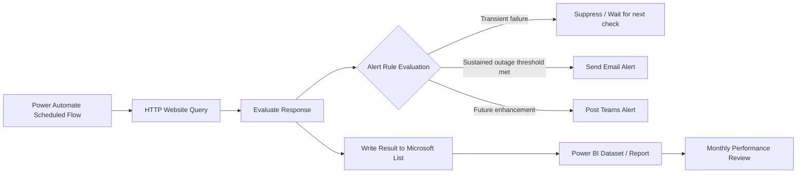

# Website Monitoring Dashboard Using Microsoft 365

A lightweight website monitoring and alerting workflow built using Microsoft Power Automate, Microsoft Lists, Outlook / Teams notifications, and Power BI reporting.

This project documents a practical low-code approach for monitoring the availability of a public website, recording each check into a Microsoft List, reducing alert noise through outage detection logic, and preparing the dataset for monthly service performance reporting.

## Project Summary

The monitoring workflow performs scheduled website availability checks at a defined interval. Each query result is written into a Microsoft List for traceability and trend analysis. Alerting logic is applied so that short transient failures do not immediately trigger excessive email notifications.

The current implementation uses:

- **Power Automate** for scheduled monitoring and alert workflow logic
- **HTTP request / website query** to test website availability
- **Microsoft Lists** as the monitoring log store
- **Outlook email alerts** for outage notification
- **Microsoft Teams alerts** as a planned enhancement
- **Power BI** as a planned reporting layer for monthly performance review

## Current Monitoring Scenario

| Item | Current Approach |
|---|---|
| Monitored asset | Public corporate website, for example `awwa.org.sg` |
| Monitoring interval | Every 5 minutes |
| Rationale for interval | Aligned to internal uptime monitoring guideline |
| Log retention approach | Every query result is stored in Microsoft Lists |
| Initial alert problem | Repeated emails during prolonged or intermittent downtime |
| Current tuning | Major outage alert fires only after approximately 15 minutes of sustained or repeated failure |
| Next enhancement | Teams alerting, richer website checks, Power BI dashboarding |

## Why This Was Built

Basic website monitoring can quickly become noisy if every failed check sends an alert. During extended downtime or intermittent failures, a simple rule such as `if website down, send email` can flood the mailbox and make alerts less actionable.

This project therefore focuses on three practical objectives:

1. **Availability visibility** — confirm whether the website is reachable at regular intervals.
2. **Evidence and logging** — retain each monitoring result for later review.
3. **Alert quality** — reduce alert fatigue by distinguishing short transient failures from sustained outages.

## High-Level Architecture

## Repository Structure

| Path | Purpose |
|---|---|
| [`docs/architecture.md`](docs/architecture.md) | System architecture and data flow |
| [`docs/alerting-logic.md`](docs/alerting-logic.md) | Alert thresholds, suppression logic, severity model, and tuning rationale |
| [`docs/data-model.md`](docs/data-model.md) | Suggested Microsoft List schema for monitoring logs |
| [`docs/dashboard-plan.md`](docs/dashboard-plan.md) | Power BI reporting plan and suggested metrics |
| [`docs/implementation-notes.md`](docs/implementation-notes.md) | Implementation considerations, limitations, and operational notes |
| [`docs/official-microsoft-references.md`](docs/official-microsoft-references.md) | Microsoft Learn references and official screenshot links |
| [`sample-data/website-monitoring-log-sample.csv`](sample-data/website-monitoring-log-sample.csv) | Sanitized sample monitoring dataset |
| [`templates/outage-review-template.md`](templates/outage-review-template.md) | Post-outage / monthly review template |

## Key Design Principles

### 1. Monitor at a meaningful interval

The website is checked every 5 minutes because this aligns to the uptime guideline used for this monitoring case. This interval is frequent enough to detect availability issues but not so frequent that it becomes unnecessarily noisy for a low-code workflow.

### 2. Log every query result

Each check is stored in Microsoft Lists. This provides a basic evidence trail for:

- Availability trend analysis
- Outage duration review
- Alert validation
- Monthly performance reporting
- Future Power BI dashboarding

### 3. Avoid alert fatigue

The workflow was tuned so that every single failure does not immediately generate an alert. A sustained outage threshold of approximately 15 minutes is used before major outage notification.

This helps distinguish:

- Short transient failures
- Intermittent degradation
- Sustained major outage

### 4. Separate monitoring, alerting, and reporting

The design separates three concerns:

| Layer | Purpose |
|---|---|
| Monitoring | Query website and record result |
| Alerting | Decide whether the failure pattern requires notification |
| Reporting | Show uptime, outage count, response trends, and month-on-month performance |

## Current Status

| Capability | Status |
|---|---|
| Scheduled website query | Implemented |
| 5-minute monitoring interval | Implemented |
| Microsoft List logging | Implemented |
| Email alerting | Implemented |
| Major outage threshold tuning | Implemented |
| Teams alerting | Planned |
| Additional website checks | Planned |
| Power BI dashboard | Planned |
| Monthly service performance reporting | Planned |

## Planned Enhancements

- Add Teams channel notifications for major incidents.
- Add severity-based routing for different websites or services.
- Track response time, not only up/down status.
- Add SSL certificate expiry monitoring.
- Add keyword/content check to confirm the correct page is served.
- Add intermittent outage detection, such as repeated failures within a rolling window.
- Export Microsoft List data to Power BI for monthly trending.
- Build monthly uptime, downtime, outage count, and mean time to recovery visuals.
- Add alert acknowledgement and incident review fields.

## Disclaimer

This repository is a sanitized portfolio documentation project. It does not include internal credentials, tenant identifiers, flow IDs, mailbox addresses, production screenshots, security-sensitive configuration, or confidential organizational information.

Screenshots referenced in this repository are externally linked from official Microsoft Learn pages where included. They are provided as product-reference visuals only and should be replaced with sanitized implementation screenshots if this repository is used for internal documentation.