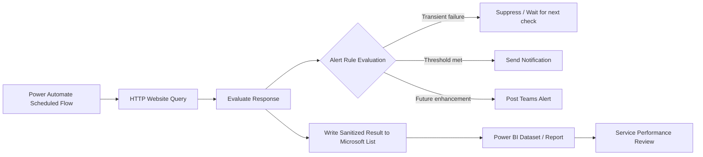

# Website Monitoring Dashboard Using Microsoft 365

A generic reference project for building lightweight website availability monitoring with Microsoft Power Automate, Microsoft Lists, Outlook or Teams notifications, and Power BI reporting.

> **Public portfolio boundary:** this repository is a generic design example. It does not document any employer's production environment, internal monitoring standard, target system, operational threshold, tenant configuration, or confidential process.

## Problem

Simple website monitoring becomes noisy when every failed request generates an alert. This reference design separates:

1. **Monitoring** — query a public endpoint at a configurable interval.
2. **Evidence** — log successful and failed checks for later analysis.
3. **Alerting** — notify only when a configurable failure condition is met.
4. **Reporting** — prepare the resulting dataset for service-performance review.

## Reference Architecture

```mermaid
flowchart LR
    A[Power Automate Scheduled Flow] --> B[HTTP Website Query]
    B --> C[Evaluate Response]
    C --> D[Write Sanitized Result to Microsoft List]
    C --> E{Alert Rule Evaluation}
    E -->|Transient failure| F[Suppress / Wait for next check]
    E -->|Threshold met| G[Send Notification]
    E -->|Future enhancement| H[Post Teams Alert]
    D --> I[Power BI Dataset / Report]
    I --> J[Service Performance Review]
```

## Illustrative Configuration

The values below are examples for demonstrating workflow logic only. They are not intended to represent a production configuration or internal standard.

| Item | Illustrative value |
|---|---|
| Monitored asset | `https://example.com` |
| Query interval | 5 minutes |
| Major alert threshold | 3 consecutive failures / approximately 15 minutes |
| Log retention | Every query result recorded |
| Notification | Email; Teams optional |
| Reporting | Power BI optional |

Actual thresholds should be selected from service criticality, recovery objectives, false-positive tolerance, platform limits, cost, and operational response capability.

## Repository Structure

| Path | Purpose |
|---|---|
| [`docs/architecture.md`](docs/architecture.md) | Generic architecture and data flow |
| [`docs/alerting-logic.md`](docs/alerting-logic.md) | Illustrative thresholding, suppression and severity logic |
| [`docs/data-model.md`](docs/data-model.md) | Suggested Microsoft List schema |
| [`docs/dashboard-plan.md`](docs/dashboard-plan.md) | Example Power BI metrics and visuals |
| [`docs/implementation-notes.md`](docs/implementation-notes.md) | Generic implementation considerations |
| [`docs/official-microsoft-references.md`](docs/official-microsoft-references.md) | Microsoft Learn references |
| [`sample-data/website-monitoring-log-sample.csv`](sample-data/website-monitoring-log-sample.csv) | Synthetic sample monitoring data |
| [`templates/outage-review-template.md`](templates/outage-review-template.md) | Generic outage-review template |

## Design Principles

### Log both success and failure

Uptime and reliability analysis require evidence of successful checks as well as failures. A monitoring log should therefore record each scheduled result consistently.

### Suppress transient noise

A single timeout does not necessarily justify an incident. Consecutive-failure counters, suppression state, and recovery notifications can reduce duplicate or low-value alerts.

### Separate state from history

A compact state record can track the current incident, consecutive failures, and whether an alert has already been sent. The historical log can then remain append-only for analysis.

### Keep alert thresholds configurable

Different services justify different detection and escalation thresholds. Avoid hard-coding one threshold as universally appropriate.

## Example Capability Status

This repository documents a reference pattern rather than a production deployment.

| Capability | Reference coverage |
|---|---|
| Scheduled HTTP query | Documented |
| Microsoft List logging | Documented |
| Failure thresholding | Documented |
| Duplicate-alert suppression | Documented |
| Recovery notification | Design example |
| Teams alerting | Design example |
| Power BI reporting | Design example |
| SSL expiry/content checks | Possible extension |

## Extensions

- Response-time monitoring
- TLS certificate expiry checks
- Keyword/content validation
- Rolling-window failure detection
- Configurable severity by service class
- Recovery notifications
- Monthly uptime and outage trend reporting
- Incident acknowledgement and review fields

## Public-Repository Rules

Do not place production details in this repository. In particular, exclude:

- employer or client names and domains;
- tenant, subscription, flow or connector identifiers;
- mailbox, Teams channel or service-account names;
- production screenshots or monitoring logs;
- internal SLA/SLO/uptime standards;
- credentials, secrets, tokens or API keys;
- internal routing, escalation paths or incident details.

Use synthetic examples such as `example.com`, generic field names, and invented sample data instead.

## Disclaimer

This repository is a personal learning and portfolio reference. It is not production documentation and does not represent the configuration, policy, or monitoring standard of any employer or client.