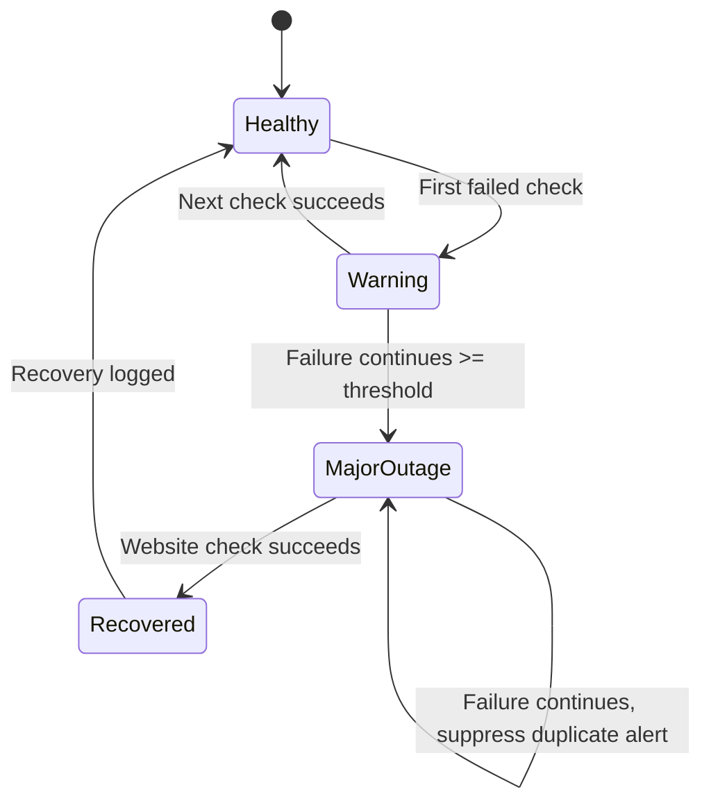

# Alerting Logic

## Purpose

The alerting logic is designed to detect meaningful website availability issues while reducing unnecessary notification noise.

The first version of the workflow sent too many email alerts when the website was down for an extended period or when failures occurred intermittently. The revised logic introduces delay, thresholding, and severity classification so that alerts are more actionable.

## Monitoring Interval

| Parameter | Value |
|---|---|
| Query interval | Every 5 minutes |
| Primary check | Website availability query |
| Logging | Every query result is stored |
| Major outage threshold | Approximately 15 minutes |

With a 5-minute interval, a 15-minute threshold generally requires multiple failed checks before a major outage alert is sent.

## Basic Status Classification

| Status | Meaning | Alert Behaviour |
|---|---|---|
| Healthy | Website responds successfully | No alert |
| Transient Failure | One failed check | Log only, no immediate major alert |
| Sustained Failure | Repeated failures across the alert threshold | Send major outage alert |
| Intermittent Failure | Repeated fail/recover pattern within a period | Planned enhancement |
| Recovery | Website returns to healthy state after alert | Planned recovery notification |

## Severity Model

| Severity | Example Condition | Notification Approach |
|---|---|---|
| Informational | Successful check, routine log | Store in Microsoft List only |
| Low | Single failed check | Store in Microsoft List only |
| Medium | Repeated failures below major threshold | Store, monitor next run |
| High | Sustained failure for approximately 15 minutes | Send major outage alert |
| Critical | Sustained outage affecting high-sensitivity or critical service | Escalate through priority channel |

## Sensitivity Model

Not all websites or endpoints should be treated equally. Alert routing can be adjusted based on service sensitivity.

| Sensitivity | Description | Example Alert Behaviour |
|---|---|---|
| Public informational | Public website or information page | Alert after sustained outage |
| Business important | Website supports stakeholder communication or operational dependency | Shorter escalation window may be appropriate |
| Critical service | Website supports critical service access or regulated process | Higher-priority alerting and management visibility |

## Current Major Outage Logic

Current logic can be represented as:

```text
IF website_check = failed
AND failure_duration >= 15 minutes
AND major_outage_alert_not_already_sent
THEN send major outage alert
ELSE log result only
```

## Suggested Future State Logic

A more mature version should track alert state so that the flow does not repeatedly alert for the same outage.

```text
For each scheduled check:

1. Run website query.
2. Create monitoring log item.
3. If result is healthy:
   - Reset consecutive failure count.
   - If prior alert state was Outage, send recovery notification.
   - Mark alert state as Healthy.
4. If result is failed:
   - Increment consecutive failure count.
   - Calculate failure duration.
   - If failure duration is below threshold, suppress alert.
   - If failure duration meets threshold and no active outage alert exists, send major outage alert.
   - If active outage alert already exists, suppress duplicate alert.
```

## Alert Noise Controls

| Control | Purpose |
|---|---|
| Consecutive failure count | Prevent alerting on one-off failed checks |
| Alert suppression window | Prevent repeated alerts during the same outage |
| Alert state field | Track whether an outage has already been notified |
| Recovery notification | Close the loop when service returns to normal |
| Severity routing | Notify different audiences depending on impact |

## Example Alert State Machine



## Email Alert Example

Subject:

```text
[Major Outage] Public Website Availability Alert
```

Body:

```text
The website monitoring workflow has detected a sustained availability issue.

Website: <Target Name>
URL: <Target URL>
Severity: High
First Failed Check: <Timestamp>
Latest Failed Check: <Timestamp>
Duration: <Duration>
HTTP Status / Error: <Status or Error>

This alert was triggered after the configured major outage threshold was reached.
```

## Teams Alert Example

Planned Teams message format:

```text
🚨 Website Monitoring Alert

Status: Major Outage
Website: <Target Name>
Detected Since: <Timestamp>
Duration: <Duration>
Latest Status: <HTTP Status / Error>

Action: Please validate website availability and begin incident triage if confirmed.
```

## Monthly Review Questions

- How many failed checks occurred this month?
- How many alerts were sent?
- How many failures were suppressed as transient?
- How many major outages occurred?
- How long was the longest outage?
- Were any alerts false positives?
- Should thresholds be adjusted?
- Were recovery notifications accurate?

## Improvement Backlog

- Track consecutive failed checks.
- Track active outage state.
- Add recovery notification.
- Add intermittent failure detection.
- Add configurable thresholds by website sensitivity.
- Add Teams notification and escalation channel.
- Add monthly alert quality review.