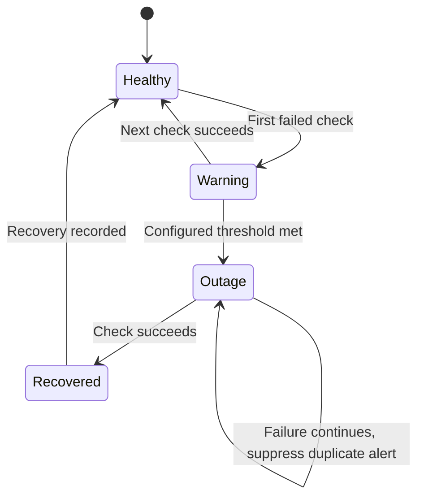

# Alerting Logic

## Purpose

This document describes generic alerting patterns for website availability monitoring. It is a portfolio/reference design only and does not represent any employer's production threshold, internal monitoring standard, escalation path, SLA or SLO.

## Illustrative Monitoring Parameters

| Parameter | Example value |
|---|---|
| Query interval | 5 minutes |
| Primary check | Website availability query |
| Logging | Every query result is stored |
| Major alert threshold | 3 consecutive failures / approximately 15 minutes |

These values are chosen only to make the control logic easy to understand. Actual monitoring thresholds should be selected from service criticality, recovery objectives, false-positive tolerance, cost, and operational response capability.

## Generic Status Classification

| Status | Meaning | Alert behaviour |
|---|---|---|
| Healthy | Endpoint responds successfully | No alert |
| Transient failure | Isolated failed check | Log only |
| Sustained failure | Repeated failures across configured threshold | Send outage alert |
| Intermittent failure | Repeated fail/recover pattern | Optional rolling-window alert |
| Recovery | Service returns after an active outage | Send recovery notification |

## Generic Severity Model

| Severity | Example condition | Notification approach |
|---|---|---|
| Informational | Successful routine check | Store only |
| Low | Single failed check | Store only |
| Medium | Repeated failures below escalation threshold | Continue monitoring |
| High | Configured outage threshold met | Send priority notification |
| Critical | High-impact or critical-service outage | Use organisation-approved escalation process |

## Reference Alert Logic

```text
IF latest_check = failed
AND configured_failure_threshold_met = true
AND active_outage_alert = false
THEN send outage alert
ELSE log result only
```

A more mature flow can track state:

```text
For each scheduled check:

1. Run endpoint query.
2. Record monitoring result.
3. If healthy:
   - Reset consecutive failure count.
   - If an outage was active, send recovery notification.
   - Mark state Healthy.
4. If failed:
   - Increment consecutive failure count.
   - Track first failed timestamp.
   - Suppress alert until configured threshold is met.
   - Once threshold is met, alert only if no active outage notification exists.
   - Suppress duplicate alerts while the same outage remains active.
```

## Noise-Reduction Controls

| Control | Purpose |
|---|---|
| Consecutive failure count | Reduce one-off false alerts |
| Alert-state field | Track whether an outage is already active |
| Suppression window | Prevent repeated alerts for the same condition |
| Recovery notification | Close the incident loop |
| Service classification | Allow different thresholds for different service classes |

## Reference State Machine


```mermaid
stateDiagram-v2
    [*] --> Healthy
    Healthy --> Warning: First failed check
    Warning --> Healthy: Next check succeeds
    Warning --> Outage: Configured threshold met
    Outage --> Outage: Failure continues, suppress duplicate alert
    Outage --> Recovered: Check succeeds
    Recovered --> Healthy: Recovery recorded
```

## Generic Email Example

```text
Subject: [Availability Alert] Public Endpoint

The monitoring workflow detected a sustained availability issue.

Target: <Generic Target Name>
URL: <Example URL>
State: Outage
First Failed Check: <Timestamp>
Latest Failed Check: <Timestamp>
Duration: <Duration>
HTTP Status / Error Category: <Sanitized value>

This notification was triggered after the configured alert threshold was met.
```

## Generic Teams Example

```text
Website Monitoring Alert

Status: Outage
Target: <Generic Target Name>
Detected Since: <Timestamp>
Duration: <Duration>
Latest Status: <Sanitized status/error>

Action: Validate availability and begin triage if confirmed.
```

## Review Questions

- How many failed checks occurred?
- How many alerts were sent?
- How many failures were suppressed as transient?
- How many distinct outage events occurred?
- Were there false positives?
- Should thresholds be adjusted?
- Did recovery notifications work correctly?

## Public Portfolio Boundary

Keep all examples synthetic. Do not include production URLs, internal thresholds, recipient lists, Teams channels, SLA/SLO values, escalation paths, screenshots, or incident details.