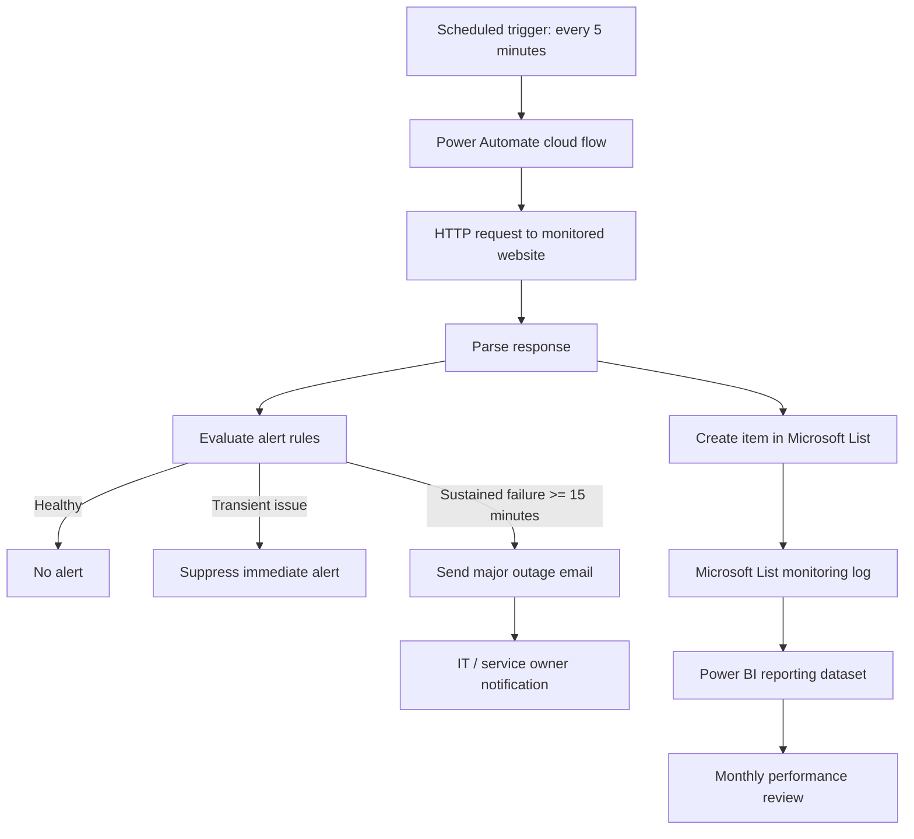
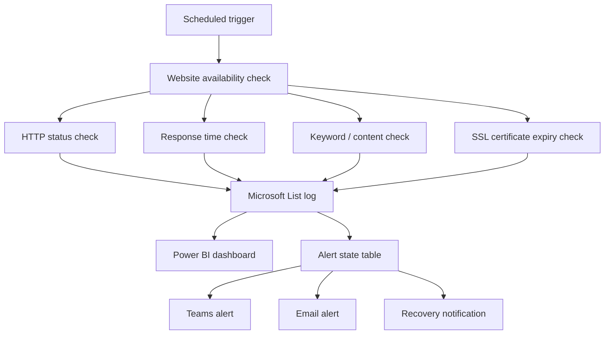

# Architecture

## Objective

The objective is to provide a lightweight monitoring workflow for website availability using Microsoft 365 and Power Platform components already available in many organizations.

The solution is not intended to replace an enterprise observability platform. It is intended to provide a practical, low-code monitoring baseline for public website availability, alerting, and monthly service reporting.

## Current Architecture

## Component Responsibilities

| Component | Responsibility |
|---|---|
| Power Automate scheduled trigger | Runs the monitoring workflow every 5 minutes |
| HTTP query action | Sends a request to the monitored website |
| Condition / control logic | Classifies the response as success, transient failure, intermittent issue, or major outage |
| Microsoft List | Stores every monitoring result as a structured log item |
| Outlook email | Sends major outage alerts after the threshold is reached |
| Microsoft Teams | Planned channel-based alerting and operational visibility |
| Power BI | Planned trend dashboard for uptime and monthly review |

## Monitoring Flow

1. The scheduled cloud flow runs every 5 minutes.
2. The flow sends a website query to the configured URL.
3. The response is evaluated based on availability indicators, such as HTTP status, timeout, or connection failure.
4. A log item is created in Microsoft Lists for each query.
5. The alerting logic checks whether the issue is transient or sustained.
6. If the sustained outage threshold is reached, an alert is sent.
7. Log data is later used for Power BI reporting and monthly review.

## Current Alert Tuning

The original implementation generated too many email alerts during prolonged or intermittent downtime. To reduce alert fatigue, the workflow was tuned so that a major outage alert is sent after approximately 15 minutes of sustained or repeated failure.

With a 5-minute monitoring interval, a 15-minute threshold generally means the workflow waits for multiple failed checks before escalating.

## Logical Layers

| Layer | Description | Example Output |
|---|---|---|
| Collection | Query website and capture result | HTTP status, timestamp, response time |
| Storage | Store each query result | Microsoft List item |
| Evaluation | Determine severity and alert requirement | Healthy, degraded, major outage |
| Notification | Notify relevant parties | Email, future Teams alert |
| Reporting | Show trends and service performance | Power BI dashboard |

## Design Rationale

### Why Power Automate

Power Automate is suitable for this use case because the workflow is simple, scheduled, and integration-focused. It can connect scheduled triggers, HTTP requests, Microsoft Lists, email notifications, and Teams notifications with minimal custom code.

### Why Microsoft Lists

Microsoft Lists provides a simple structured log store that is easy to review, filter, and export. It is also suitable as a source for Power BI reporting.

### Why alert suppression is needed

Alerting on every failed query creates unnecessary noise. A monitoring tool should help responders focus on material incidents, not flood them with duplicate notifications.

## Current Limitations

- The current version focuses on availability, not full user journey monitoring.
- The workflow may not distinguish all causes of failure without additional checks.
- Power Automate timing may not be as precise as a dedicated monitoring platform.
- Microsoft Lists is suitable for lightweight logging but may not be ideal for high-volume telemetry.
- Email alerts can still create noise if alert state and recovery logic are not carefully handled.

## Future Architecture

## Security and Governance Considerations

- Do not store credentials in plain text.
- Avoid logging sensitive response content.
- Use least privilege for connectors and flow owners.
- Maintain clear ownership for the flow, Microsoft List, alert recipients, and dashboard.
- Periodically review alert thresholds and false positives.
- Sanitize logs before using them in public portfolio documentation.