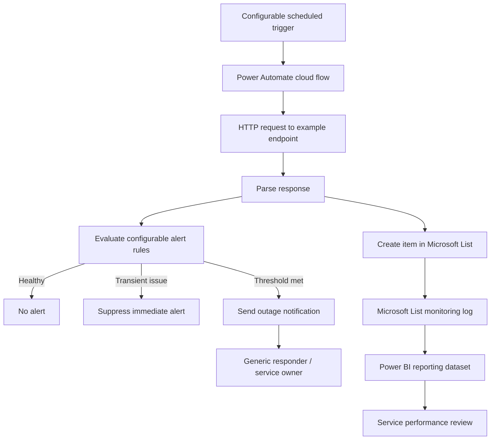
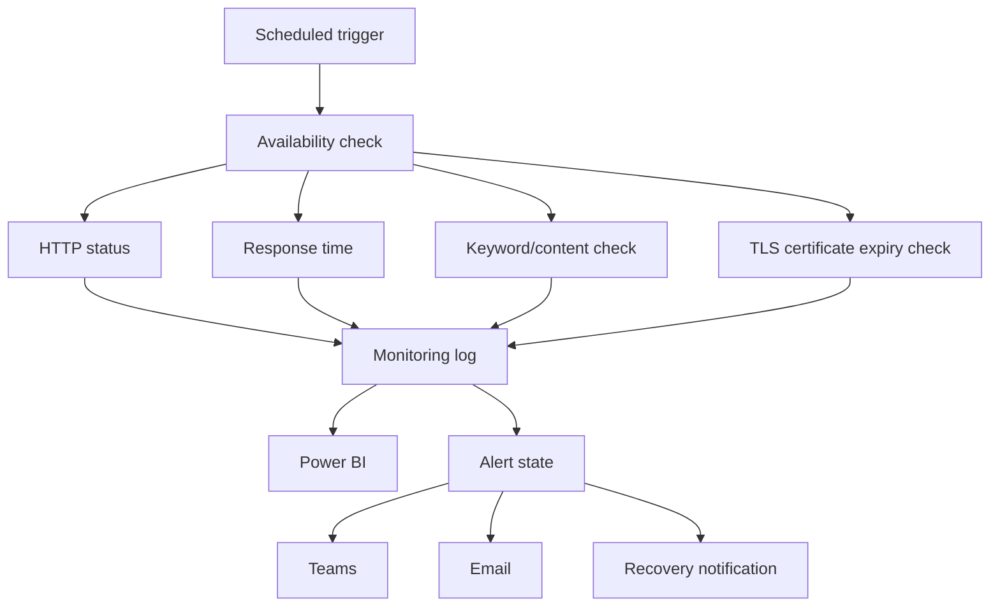

# Architecture

## Objective

This document describes a generic low-code reference architecture for public website availability monitoring using Microsoft 365 and Power Platform components.

It is not production documentation and does not represent any employer/client environment, internal monitoring standard, operational threshold, SLA/SLO, target system, or escalation process.

## Reference Architecture

```mermaid
flowchart TD
    A[Configurable scheduled trigger] --> B[Power Automate cloud flow]
    B --> C[HTTP request to example endpoint]
    C --> D[Parse response]
    D --> E[Create item in Microsoft List]
    D --> F[Evaluate configurable alert rules]
    F -->|Healthy| G[No alert]
    F -->|Transient issue| H[Suppress immediate alert]
    F -->|Threshold met| I[Send outage notification]
    I --> J[Generic responder / service owner]
    E --> K[Microsoft List monitoring log]
    K --> L[Power BI reporting dataset]
    L --> M[Service performance review]
```

## Component Responsibilities

| Component | Responsibility |
|---|---|
| Power Automate scheduled trigger | Runs the workflow at a configurable interval |
| HTTP query action | Sends a request to a public example endpoint |
| Condition/control logic | Classifies responses and evaluates configured thresholds |
| Microsoft List | Stores monitoring results as structured records |
| Outlook / Teams | Optional notification channels |
| Power BI | Optional trend and service-performance reporting |

## Generic Monitoring Flow

1. The scheduled flow runs at a configured interval.
2. The flow queries the configured public endpoint.
3. The response is evaluated using availability indicators such as HTTP status, timeout, or connection failure.
4. A sanitized log record is written for each check.
5. Alerting logic distinguishes isolated from sustained failures.
6. When the configured condition is met, a notification is sent.
7. Historical records can be used for reliability reporting and trend analysis.

## Illustrative Threshold Example

For demonstration, a lab might check every 5 minutes and alert after three consecutive failures. This is only an example to make the state logic concrete.

Production thresholds should instead be chosen from factors such as:

- service criticality;
- recovery objectives;
- false-positive tolerance;
- response capacity;
- platform/cost constraints; and
- approved organisational policy.

## Logical Layers

| Layer | Description | Example output |
|---|---|---|
| Collection | Query endpoint and capture result | HTTP status, timestamp, response time |
| Storage | Persist each query result | Microsoft List record |
| Evaluation | Determine status and alert requirement | Healthy, degraded, outage |
| Notification | Notify configured recipients | Email or Teams |
| Reporting | Show trends and service performance | Power BI visuals |

## Design Rationale

### Why Power Automate

Power Automate is suitable for a lightweight integration-oriented workflow because it can connect scheduled triggers, HTTP requests, Microsoft Lists and notifications without requiring a dedicated monitoring service.

### Why Microsoft Lists

Microsoft Lists provides a simple structured store that can be reviewed, filtered and used as a source for reporting in small-scale scenarios.

### Why alert suppression matters

Alerting on every failed query creates noise. Consecutive-failure logic and active-outage state can make notifications more actionable.

## Limitations

- This is availability checking, not full observability or synthetic user-journey monitoring.
- Power Automate timing is not as precise as a dedicated monitoring platform.
- Microsoft Lists is suitable only for lightweight telemetry volumes.
- Root-cause identification requires additional evidence beyond a failed HTTP query.
- Notification state and recovery logic need careful testing to avoid noise or missed alerts.

## Possible Extensions

```mermaid
flowchart TD
    A[Scheduled trigger] --> B[Availability check]
    B --> C[HTTP status]
    B --> D[Response time]
    B --> E[Keyword/content check]
    B --> F[TLS certificate expiry check]
    C --> G[Monitoring log]
    D --> G
    E --> G
    F --> G
    G --> H[Power BI]
    G --> I[Alert state]
    I --> J[Teams]
    I --> K[Email]
    I --> L[Recovery notification]
```

## Public Portfolio Boundary

- Use `example.com` or other synthetic targets.
- Do not store credentials in source or screenshots.
- Do not publish employer/client names, production URLs, internal thresholds, recipient lists, SLA/SLO values, tenant IDs, flow IDs, operational screenshots, logs, or incident details.
- Treat every numerical threshold in this repository as illustrative unless explicitly stated otherwise.